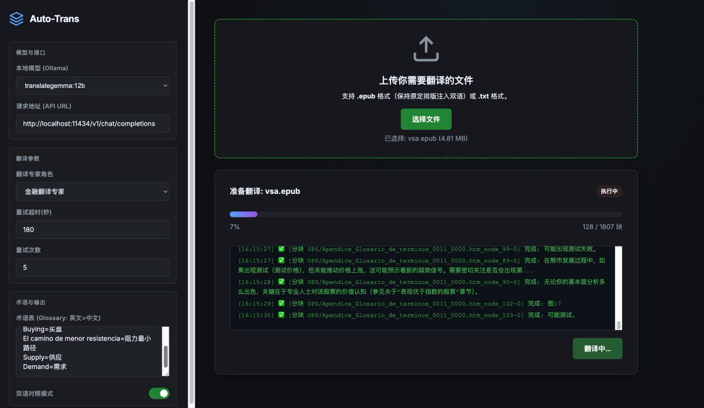

# Auto-Translator

本项目是一个完全本地运行的翻译工具，支持 WebUI 交互式翻译与角色化 System Prompt 扩展。

## 启动与使用 WebUI 翻译

### 1. 环境要求

- Go 1.22+
- Ollama

### 2. 启动 WebUI

安装translategemma:12b
```bash
ollama pull translategemma:12b
```

在项目根目录执行：

```bash
go run ./cmd/webrunner/main.go
```

启动成功后打开浏览器访问：输出的地址

```
> $ go run cmd/webrunner/main.go                                                                                                                      [±main ●●●]
Web server is running beautifully at http://localhost:4002

```



### 3. 使用流程

- 选择模型与 API 地址
- 选择翻译专家角色
- 设定重试超时与重试次数
- 上传 .epub 或 .txt 文件
- 点击开始执行翻译
- 任务完成后点击下载译本

## 扩展翻译角色

系统会自动加载 prompts 目录下的所有 Markdown 文件作为“翻译专家”角色，文件名即为角色名称。

### 新增角色步骤

1. 在 prompts 目录新建 Markdown 文件，例如：

```
prompts/新能源翻译专家.md
```

2. 在文件中写入角色的 System Prompt 内容，例如：

```
你是一位新能源行业资深译者，熟悉电池、电驱与储能领域术语。
请将输入文本翻译为准确、简洁、符合工程师阅读习惯的中文。
仅输出翻译结果，不要包含原文或说明。
```

3. 刷新 WebUI，即可在角色下拉菜单中看到新角色